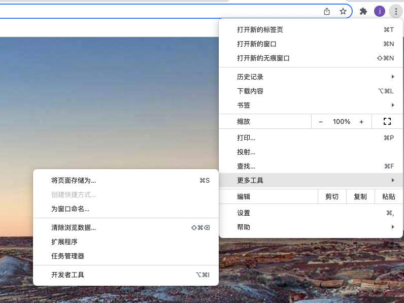
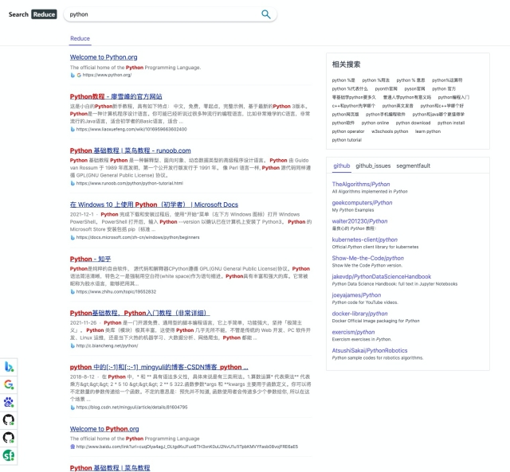

## 安装

1. 克隆项目到本地

   ```sh
   git clone https://github.com/charonX/search_reduce.git
   ```

2. 打开 Chrome 扩展程序界面

   

3. 在页面右上角打开开发者模式

   

4. 点击加载已解压的扩展程序按钮，选择刚刚下载的代码目录

   

5. 结果显示如下图，安装完成。

   

<p align="right">(<a href="#top">back to top</a>)</p>

## 使用
### 注意事项
首次安装插件后，打开新页面 Chrome 会提示新标签页被插件修改，如下图：


点击保持现状按钮后继续使用插件，点击改回原来的设置按钮则插件不启用。

### 新标签页

#### 展示


#### 功能点

1. 搜索框
2. 快捷网址入口
   a. 初次使用插件时，快捷入口为经常访问的10个网站。
   b. 可以添加最多10个快捷入口。
   c. 鼠标悬浮后图标右上角会出现编辑和删除图标，可对快捷入口进行编辑和删除操作。快捷入口不满10个时会出现添加入口。

### 地址栏快捷操作
在地址栏输入sr之后按【空格】或者【tab】键可以切换为本插件的聚合搜索，然后输入关键字回车后，可直接跳转到搜索结果页。

### 搜索结果页

#### 展示



#### 功能点

搜索结果页主要分为五个部分：

1. 搜索框
2. 搜索结果
   1. 搜索结果为多个搜索引擎的搜索结果聚合，去除广告等相关推广内容。搜索结果地址前的图标为此条内容是通过哪个搜索引擎搜到的。
   2. 搜索结果由于百度的结果链接为加密链接，所以百度的搜索结果未进行整合，后续会考虑按内容的重合度来做整合。
3. 相关搜索
   1. 相关搜索为所有搜索引擎的相关搜索结果聚合。
4. 网站搜索结果
   1. 相关搜索下方为网站搜索结果聚合，主要包含了程序员的常用网站 Github repository, Github issues 以及 segmentfault，后续会添加一些其他的网站，并且可以进行添加删除配置。
5. 各个网站请求状态
   1. 结果页左下方图标为搜索请求状态，绿色点为成功，红色点为失败。